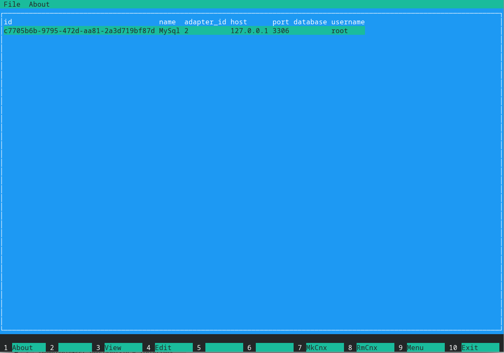
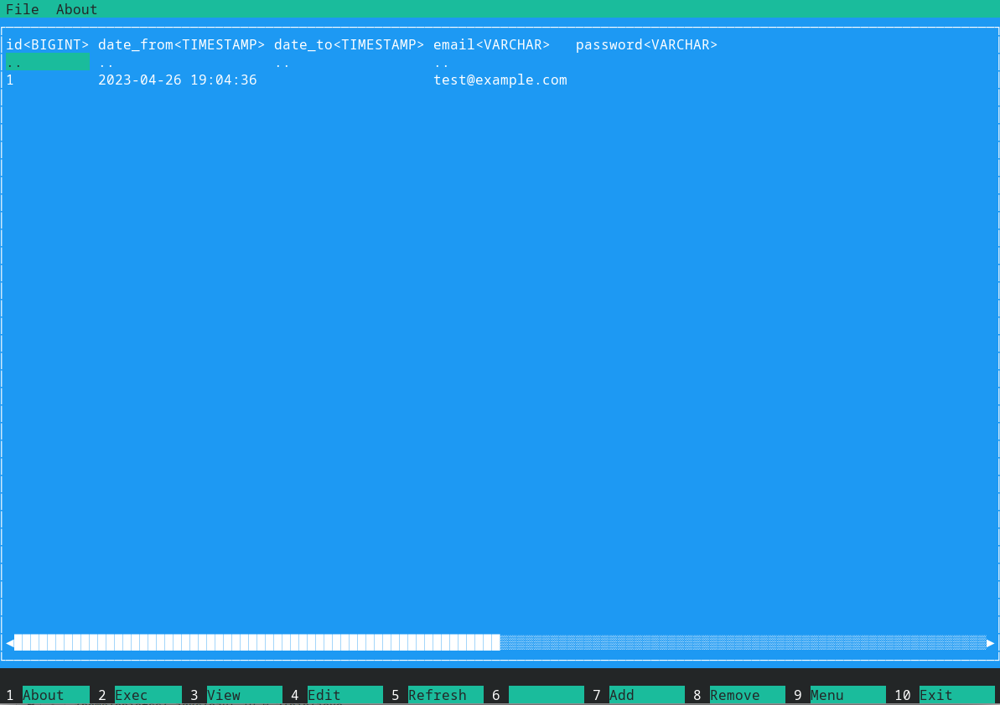

# CDBTool
TUI database tool. 

### Application features:

* TUI interface.
* Connect to MySql, Postgres (other in progress)
* Multiple connections.
* View tables.
* Execute SQL.

## Screenshots

### Main page:


### Detail view:


Installation
------------

```bash
$ git clone https://github.com/chiefss/cdbtool
$ cd cdbtool
$ mvn clean package
```
Jar file will be created in the directory target.


Configuration
------------
CDBTool create a file config.yml in the same directory as the jar file.

Config.yml exaple:
```
connections:
- id: "c7705b6b-9795-472d-aa81-2a3d719bf87d"
  name: "MySql"
  adapterId: 2
  host: "127.0.0.1"
  port: 3306
  database: ""
  username: "root"
  password: "root"
```


Simply run:
------------

```bash
$ java -jar ./cdbtool-0.0.1-SNAPSHOT.jar
```
